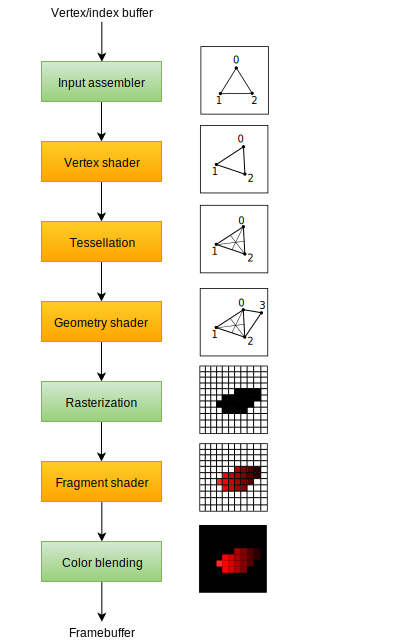

# Sparse notes on Vulkan and Computer Graphics

This repository documents my process of studying the Vulkan API and my efforts in getting to know low level graphical APIs to eventually being able to create cool graphic projects or implement complex graphics workflows in my own projects.
It also documents an effor to better understand low level concepts as a whole and to make my C++ up to speed with modern standards. 
So watch how I fail and this repository gets forgotten in a month ;`)

As of now, the repository only contains code relative to the introductory steps of the [Khronos Group's Vulkan Tutorial](https://docs.vulkan.org/tutorial/latest/00_Introduction.html), but I'll update it with other projects or link other repos I'll create during the process.

After every lesson in the tutorial I'll make a commit.
My objective is to have a commit a day, and see where it goes.

## On the graphics pipeline

  

Messy notes about general concepts:

- The pipeline is a **sequence of operations** that transform vertex/texture data into rendered pixels
- There are two kind of stages: **fixed-function** and **programmable**
    - Fixed function are **Input Assembler, Rasterization and Color Blending**
- Some programmable stages are optional, based on your intent.
    - Geometry or tessellation can be disabled for simple geometry, or the fragment shader can be disabled for shadow map generation

- Compared to other APIs, the graphics pipeline in Vulkan is **immutable**, and must be **recreated from scratch** if a change in shaders, blending function or a different framebuffer bind is needed.
    - Less ergonomics, more performance

- Detail on what every stage of the pipeline does are absent for now to avoid clutter, here are some highlights:
    - Vertex shader is used to apply transformation to every vertex
        - Vertices are simply points in a 3D space, bundled with certain additional attributes (like normals, colors etc)
    - Rasterization stage breaks primitives (triangles, lines, point) into **fragments** and here you can discard fragments based on their position relative to other fragments or the camera
    - Fragment shader is invoked for every surviving fragment and determines in which framebuffers the fragments are written to and with which color and depth
    - Color blending stage mixes different fragments that map to the same pixel.
        - For example if a transparent red glass has a yellow wall behind it, you'll mix the colors based on this information
    
    